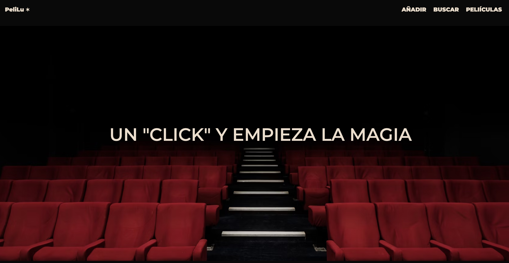
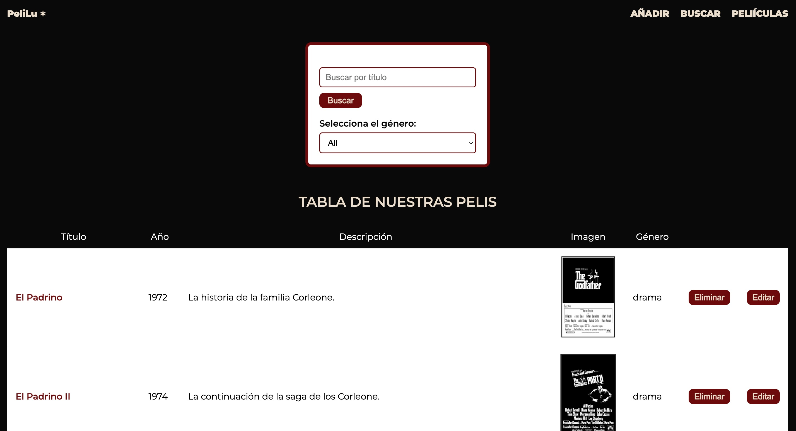

# PÁGINA WEB DE PELÍCULAS  🍿

Este proyecto es una página web de una plataforma de películas (ficticia) para un ejercicio del bootcamp "Desarrollo Web Full Stack" en The Bridge . El objetivo principal fue aplicar los conocimientos aprendidos hasta la semana 3 (maquetación con HTML5 y CSS3 y uso de JavaScript + manipulación del DOM).

El usuario podrá:
- Introducir los datos de una película y que estos se añadan a una tabla.
- Buscar una película en la tabla: por filtro género y título y que aparezcan las que coincidan (sino se añade filtro, aparecen todas por defecto).
- Borrar las películas de la tabla.
- Editar el contenido de las películas de la tabla.

##  Tecnologías usadas 👩🏽‍💻

- HTML5
- CSS3
- Flexbox
- Google Fonts
- Java Script
- Manipulación del DOM


## Objetivo del proyecto 🔎

- Crear un formulario para añadir películas y ponerle alguna   validación.
- Almacenar los datos del formulario en una tabla (tiene que actualizarse)
- Crear filtros de busqueda de pelicula combinados (Título y género)
- Crear un diseño responsive adaptado a móviles.
- Organizar correctamente los recursos en carpetas.
- Aprender a documentar el proyecto en un README.

## Capturas de pantalla 📸





## REPOSITORIO DE GIT 📁

https://github.com/luciaaroca/peliculas.git

## URL DEL PROYECTO

Puedes ver el proyecto online en:  
https://luciaaroca.github.io/peliculas/


## Lecciones aprendidas 💡

- Uso de Regex.
- Crear elementos en el html a través de Template Strings.
- Actualizar la información del formulario dependiendo del contenido de la tabla.
- Aplicar filtro y combinarlos.
- Crear un botón para borrar y editar información de la tabla
- Entender más el funcionamiento del DOM y lo útil que puede llegar a ser.
- Adaptabilidad a pantallas más pequeñas.


## Estructura del proyecto 

```
/assets - imágenes y recursos 
/css - hoja de estilos principal
/js-interactividad
peliculas.js - almacenamiento del array
script.js-desarollo 
index.html - archivo principal
README.md - documentación
```

## Autor ✍🏽

- Nombre: Lucía Aroca Solís
- LinkedIn: https://www.linkedin.com/in/luc%C3%ADa-aroca-sol%C3%ADs-b652552b4/
- GitHub: https://github.com/luciaaroca
```
